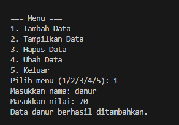
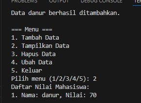
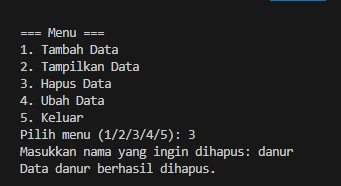
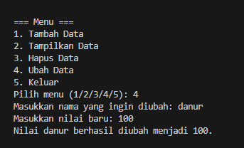

# **Program Daftar Nilai Mahasiswa**

Program ini adalah aplikasi sederhana berbasis teks untuk mengelola daftar nilai mahasiswa. Program ini dibuat menggunakan **Python** dan mengaplikasikan konsep **class** dan **object-oriented programming (OOP)**.  

## **Fitur Program**
1. **Tambah Data**  
   Menambahkan data mahasiswa baru (nama dan nilai) ke dalam daftar.
2. **Tampilkan Data**  
   Menampilkan semua data mahasiswa dalam daftar.
3. **Hapus Data**  
   Menghapus data mahasiswa berdasarkan nama.
4. **Ubah Data**  
   Mengubah nilai mahasiswa berdasarkan nama.
5. **Keluar Program**  
   Mengakhiri program.

---

## **Struktur Class**

### **Class**: `DaftarNilaiMahasiswa`

| Atribut/Method   | Deskripsi                                                                 |
|-------------------|---------------------------------------------------------------------------|
| `__init__`        | Inisialisasi class, membuat atribut `data_mahasiswa` berupa list kosong. |
| `tambah(nama, nilai)` | Menambahkan data mahasiswa ke dalam daftar.                           |
| `tampilkan()`     | Menampilkan seluruh data mahasiswa dalam daftar.                        |
| `hapus(nama)`     | Menghapus data mahasiswa berdasarkan nama.                              |
| `ubah(nama, nilai_baru)` | Mengubah nilai mahasiswa berdasarkan nama.                         |

---

## **Penjelasan Code**

### 1. **Inisialisasi Class**
```python
class DaftarNilaiMahasiswa:
    def __init__(self):
        self.data_mahasiswa = []
```
### 2. **Method Tambah**
```python
def tambah(self, nama, nilai):
    self.data_mahasiswa.append({"nama": nama, "nilai": nilai})
    print(f"Data {nama} berhasil ditambahkan.")
```

### 3. **Method Tampilkan**
```python
def tampilkan(self):
    if not self.data_mahasiswa:
        print("Belum ada data mahasiswa.")
    else:
        for idx, mahasiswa in enumerate(self.data_mahasiswa, start=1):
            print(f"{idx}. Nama: {mahasiswa['nama']}, Nilai: {mahasiswa['nilai']}")

```

### 4. **Method Hapus**
```python
def hapus(self, nama):
    for mahasiswa in self.data_mahasiswa:
        if mahasiswa["nama"].lower() == nama.lower():
            self.data_mahasiswa.remove(mahasiswa)
            print(f"Data {nama} berhasil dihapus.")
            return
    print(f"Data dengan nama {nama} tidak ditemukan.")

```

### 5. **Method Ubah**
```python
def ubah(self, nama, nilai_baru):
    for mahasiswa in self.data_mahasiswa:
        if mahasiswa["nama"].lower() == nama.lower():
            mahasiswa["nilai"] = nilai_baru
            print(f"Nilai {nama} berhasil diubah menjadi {nilai_baru}.")
            return
    print(f"Data dengan nama {nama} tidak ditemukan.")

```


## Flowchart 

```mermaid
flowchart TD
    A[Mulai] --> B{Pilih Menu}
    B --> C[Tambah Data]
    B --> D[Tampilkan Data]
    B --> E[Hapus Data]
    B --> F[Ubah Data]
    B --> G[Keluar Program]

    C --> C1[Masukkan Nama dan Nilai]
    C1 --> C2[Tambahkan ke Daftar]
    C2 --> H[Kembali ke Menu]

    D --> D1{Apakah Data Kosong?}
    D1 -->|Ya| D2[Tampilkan Pesan: Belum Ada Data]
    D1 -->|Tidak| D3[Tampilkan Semua Data]
    D2 --> H
    D3 --> H

    E --> E1[Masukkan Nama]
    E1 --> E2{Nama Ditemukan?}
    E2 -->|Ya| E3[Hapus Data dari Daftar]
    E2 -->|Tidak| E4[Tampilkan Pesan: Nama Tidak Ditemukan]
    E3 --> H
    E4 --> H

    F --> F1[Masukkan Nama]
    F1 --> F2{Nama Ditemukan?}
    F2 -->|Ya| F3[Masukkan Nilai Baru]
    F3 --> F4[Perbarui Nilai di Daftar]
    F2 -->|Tidak| F5[Tampilkan Pesan: Nama Tidak Ditemukan]
    F4 --> H
    F5 --> H

    G --> I[Selesai]

    H --> B

